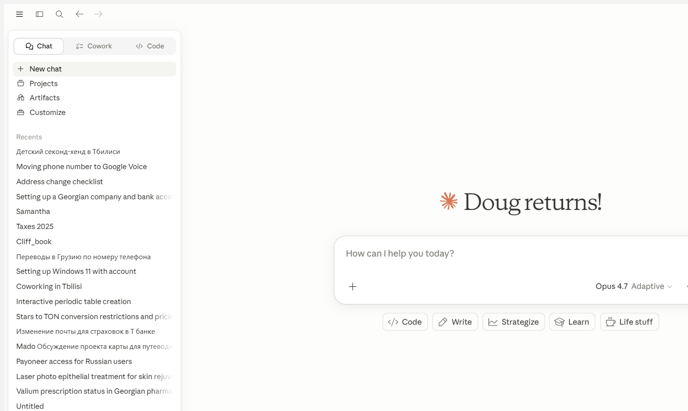

# Home screen anatomy — 2026-05-10

First successful screenshot of the Claude Windows app using `PrintWindow` with `PW_RENDERFULLCONTENT=2`. Captured while the app was behind other windows — no need to bring to foreground.

## Components identified

### Header bar
- Hamburger menu (☰) — probably opens settings or navigation
- Sidebar toggle — show/hide the sidebar
- Search (🔍) — search chats
- Back / Forward arrows — navigation history

### Sidebar
- **Tab bar**: Chat (active) | Cowork | Code — we only care about Chat
- **New chat** button — starts a new conversation
- **Projects** — opens the projects list. Visible projects will be important for migration
- **Artifacts** — not needed for our use case
- **Customize** — not needed
- **Recents** — ordered list of recent conversations. This is critical for migration:
  - Each item is a conversation title (sometimes truncated)
  - Mixed languages (English and Russian in Doug's account)
  - Scrollable — "View more" or "Show all" likely available below the fold

### Main content area (home state)
- Welcome message: "Doug returns!" with Claude asterisk logo
- Empty conversation input: "How can I help you today?"
- Attach button (+) — for uploading documents
- Model selector: "Opus 4.7 Adaptive ∨" — dropdown for model and thinking mode
- Quick action pills: Code, Write, Strategize, Learn, Life stuff

## Proposed class mapping

| Visual component | Proposed class | Reusable? |
|-----------------|---------------|-----------|
| The whole app | `ClaudeApp` | Singleton |
| The OS window | `ClaudeWindow` | Singleton |
| Header bar | `Header` | Shared across all screens |
| Sidebar | `Sidebar` | Shared across all screens |
| Tab bar (Chat/Cowork/Code) | Part of `Sidebar` | — |
| New chat button | Method on `Sidebar` | — |
| Projects link | Method on `Sidebar` | — |
| Recents list | `ChatList` | Reusable — appears here AND in project views |
| A single chat item | `ChatListItem` | Instance per conversation |
| Main content (home) | `HomeScreen` | Screen-specific |
| Message input | `MessageInput` | Reusable across home and conversation screens |
| Model selector | `ModelSelector` | Reusable |
| Attach button | Part of `MessageInput` | — |

## Key observations

1. **`ChatList` is reusable** — it appears on the home screen under "Recents" and will appear inside project views scoped to that project's conversations.
2. **`MessageInput` is reusable** — it appears on the home screen (empty state) and in every conversation.
3. **`ModelSelector` is reusable** — visible on home and in conversations.
4. **`Sidebar` is persistent** — same instance across all screens.
5. **`Header` is persistent** — same instance across all screens.
6. **The main content area changes** — this is where screen polymorphism happens (HomeScreen, ConversationScreen, ProjectScreen).

## Technical findings

- `PrintWindow` with `PW_RENDERFULLCONTENT=2` captures window content without bringing it to the foreground. This is superior to `CopyFromScreen` which captures pixels and gets whatever is on top.
- The MSIX process must be filtered by path (`WindowsApps`) to distinguish from Claude Code in VS Code.

<!-- citations -->
[first UIA read]: 01-2026-05-10-first-uia-read.md
[windows automation]: ../../windows-automation/01-electron-accessibility.md
